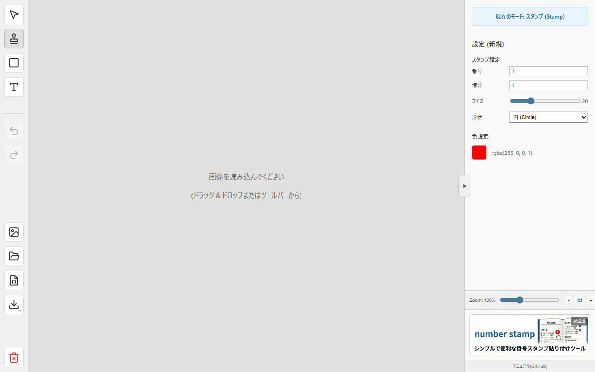
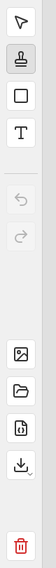
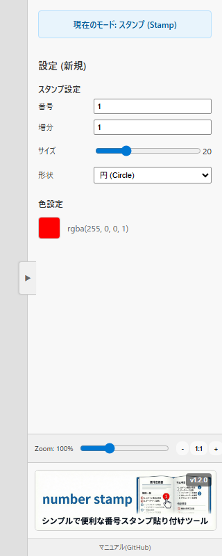

# NumberStamp

### 🚀 実行URL: <a href="https://number-stamp.vercel.app/" target="_blank" rel="noopener noreferrer">https://number-stamp.vercel.app/</a>

画像に連番付きのスタンプ（丸印・角丸四角）や矢印、矩形（枠線）を配置し、作業手順書やバグ報告、レビュー画像などを素早く作成するためのWebツールです。



## ✨ 主な機能と操作方法

ブラウザ上で画像を読み込み、直感的な操作で注釈を入れることができます。

### 1. 画像の読み込み
以下のいずれかの方法で背景画像をセットできます。
- **ドラッグ＆ドロップ**: ウィンドウ内に画像ファイルを直接ドロップします。
- **ファイル選択**: ツールバー右側の「画像アイコン」をクリックしてファイルを選択します。

### 2. ツールの種類と使い方
左側のツールバーでモードを切り替えて操作します。

| ツールバー | 機能 |
| :---: | :--- |
|  | **上から順に:**<br>👆 **選択 (Select)**: オブジェクトの選択・移動 <br>🔢 **スタンプ (Stamp)**: 連番スタンプ配置 <br>🔲 **矩形 (Rectangle)**: 枠線描画 <br>🔤 **テキスト (Text)**: テキスト配置 <br>⬇️ **画像保存**: PNG形式で保存 <br>💾 **プロジェクト保存**: JSON形式で保存 <br>📂 **プロジェクト読込**: JSON読込 <br>❌ **全削除**: キャンバス初期化 |

#### 👆 選択 (Select) モード
オブジェクトの選択・移動・編集を行います。
- **選択**: オブジェクトをクリックします。`Ctrl` (Macは `Command`) キーを押しながらクリックすると複数選択できます。
- **範囲選択**: 何もないところからドラッグすると、矩形範囲内のオブジェクトを一括選択できます。
- **移動**: 選択したオブジェクトをドラッグして移動します。
- **削除**: `Delete` キーまたは `Backspace` キーで削除します（設定パネルの「削除」ボタンも使用可）。
- **右クリック**: コンテキストメニューの代わりに、右クリックでもオブジェクトを選択できます。

#### 🔢 スタンプ (Stamp) モード
クリックした場所に連番スタンプを配置します。
- **自動連番**: スタンプを配置するたびに、設定された増分（Step）に従って番号が自動で進みます（例: 1 → 2 → 3）。
- **連続配置**: モードを切り替えるまで、連続してスタンプを押せます。

#### 🔲 矩形 (Rectangle) モード
ドラッグして矩形（四角い枠）を描画します。
- 注目させたい箇所を囲むのに便利です。
- 枠線の色や太さは設定パネルで変更可能です。

#### 🔤 テキスト (Text) モード
クリックした場所にテキストを配置します。
- **編集**: 設定パネルでテキスト内容を編集できます。
- **スタイル**: フォント、サイズ、色を変更可能です。

### 3. 詳細設定（右サイドバー）
オブジェクトを選択している時、またはツールを選択中に、右側のパネルで詳細な設定が可能です。



- **プロジェクト名**: 保存時のファイル名に使用されます。


- **スタンプ設定**:
  - **番号**: 現在の番号や、選択中のスタンプ番号を変更できます。
  - **増分**: 次に押すスタンプの番号の増え方を設定します（通常は1）。
  - **サイズ**: スライダーでスタンプの大きさを調整できます。
  - **形状**: 「円 (Circle)」と「角丸四角 (Square)」から選べます。
- **色設定**: 用意されたプリセットカラーまたはカラーピッカーから色を選択できます。
- **ズーム**: キャンバスの表示倍率を変更できます。

### 4. 矢印 (Arrow) の引き方
スタンプから別の場所へ矢印を引くことができます。
1. **選択モード**でスタンプをクリックして選択状態にします。
2. スタンプの近くに**水色（シアン色）の小さなハンドル（丸）**が表示されます。
3. そのハンドルをドラッグして、矢印の先端を好きな場所に移動させます。

### 5. 保存と書き出し
- **画像を保存 (Export)**: ツールバーの「ダウンロードアイコン」をクリックすると、現在の状態をPNG画像として保存します（高画質書き出し）。
- **プロジェクト保存 (Save)**: 「ファイルアイコン（保存）」をクリックすると、編集状態（レイヤー情報含む）をJSONファイルとして保存できます。
- **プロジェクト読み込み (Load)**: 「フォルダアイコン」から保存したJSONファイルを読み込み、編集を再開できます。

### 6. ショートカットキー
- **Undo (元に戻す)**: `Ctrl + Z` (Mac: `Cmd + Z`)
- **Redo (やり直し)**: `Ctrl + Y` (Mac: `Cmd + Shift + Z` も可)
- **Delete (削除)**: `Delete` / `Backspace`

---

## 🛠️ 開発者向け情報

React + Konva で構築されたSPA（Single Page Application）です。

### 動作環境
- Node.js (v18以上推奨)

### インストールと起動

```bash
# 依存パッケージのインストール
npm install

# 開発サーバーの起動
npm run dev
```

ブラウザで `http://localhost:5173` にアクセスして動作を確認してください。

### ビルドとデプロイ

Vercel などのホスティングサービスへのデプロイが容易です。

```bash
# プロダクションビルド
npm run build
```

ビルド成果物は `dist` ディレクトリに出力されます。

### 技術スタック
- **Vite**: ビルドツール
- **React**: UIライブラリ
- **React Konva**: HTML5 Canvas操作ライブラリ
- **Lucide React**: アイコン
- **uuid**: ユニークID生成

## 📝 更新履歴

- **v1.1.0 (2026-02-17)**:
    - 🆕 テキスト入力ツールの追加
    - 🎨 色選択で透明度(Alpha)が扱えるように改善
    - 🖼️ 画像保存時にフォーマット(PNG/JPG)を選択可能に
    - 🔧 設定パネルのバナー画像更新とUI調整
    - 🔗 実行URLの追加と別タブ表示対応
- **v1.0.0**: 初版リリース。スタンプ、矩形、矢印、画像保存機能を実装。
