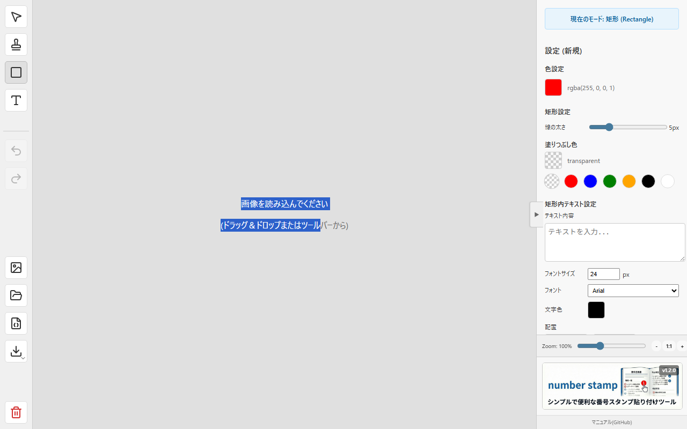
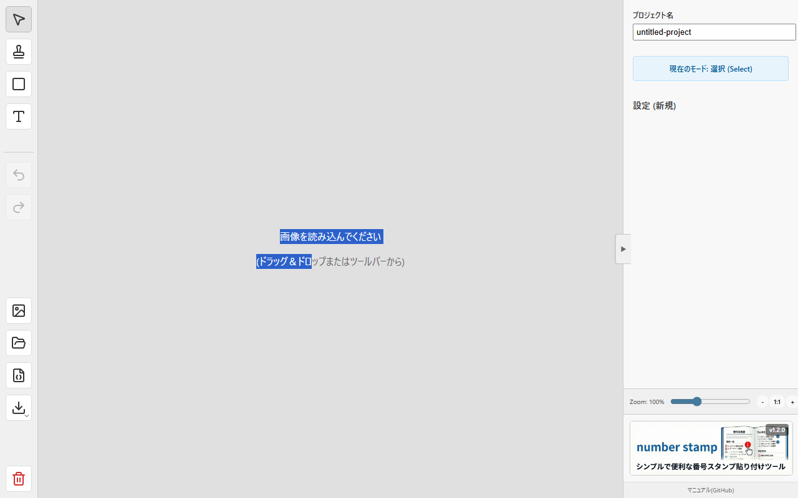

# NumberStamp

### 🚀 実行URL: <a href="https://number-stamp.vercel.app/" target="_blank" rel="noopener noreferrer">https://number-stamp.vercel.app/</a>

画像に連番付きのスタンプ（丸印・角丸四角）や矢印、矩形（枠線）を配置し、作業手順書やバグ報告、レビュー画像などを素早く作成するためのWebツールです。


## ✨ 主な機能と操作方法

ブラウザ上で画像を読み込み、直感的な操作で注釈を入れることができます。

### 1. 画像の読み込み
以下のいずれかの方法で背景画像をセットできます。
- **ドラッグ＆ドロップ**: ウィンドウ内に画像ファイルを直接ドロップします。
- **ファイル選択**: ツールバー右側の「画像アイコン」をクリックしてファイルを選択します。

### 2. ツールの種類と使い方
左側のツールバーでモードを切り替えて操作します。

| ツールバー | 機能 |
| :---: | :--- |
|  | **上から順に:**<br><br>👆 **選択 (Select)**<br>オブジェクトの選択・移動・編集<br><br>🔢 **スタンプ (Stamp)**<br>連番スタンプ配置<br><br>🔲 **矩形 (Rectangle)**<br>枠線・テキスト枠追加<br><br>🔤 **テキスト (Text)**<br>テキスト配置<br><br>↩️ **Undo / Redo**<br>元に戻す / やり直し<br><br>🖼️ **画像読込** / 📂 **プロジェクト読込**<br>ファイル読み込み関連<br><br>💾 **プロジェクト保存** / ⬇️ **画像保存**<br>保存・書き出し関連<br><br>❌ **全削除**<br>キャンバス初期化 |

---

#### 👆 選択 (Select) モード
オブジェクトの選択・移動・編集を行います。

- **基本的な操作**: オブジェクトをクリックして選択します。選択状態のオブジェクトはドラッグして移動できます。
- **複数選択**: `Ctrl` (Macは `Cmd`) キーを押しながらクリック、または何もない場所からドラッグして範囲選択することで、複数のオブジェクトをまとめて移動・削除できます。
- **右クリック**: オブジェクトを右クリックすることでも選択状態にできます。

---

#### 🔢 スタンプ (Stamp) モード
クリックした場所に連番スタンプを配置します。


- **自動連番**: スタンプを配置するたびに、設定された増分（Step）に従って番号が自動で進みます（例: 1 → 2 → 3）。
- **形状と色**: 設定パネルで「円」や「角丸四角」への切り替え、色やサイズの変更が可能です。
- **連続配置**: モードを切り替えるまで、連続してスタンプを押すことができます。

---

#### 🔲 矩形 (Rectangle) モード
ドラッグして矩形（四角い枠）を描画し、注目させたい箇所を強調します。



- **描画方法**: キャンバス上でドラッグすると、その範囲に矩形が作成されます。
- **テキスト入力**: 作成した矩形を選択し、右側の設定パネルでテキストを入力すると、枠内に文字を表示できます。
- **スタイル設定**: 枠線の色、太さ、塗りつぶしの有無、破線スタイルなどを自由に調整できます。

---

#### 🔤 テキスト (Text) モード
画像上の任意の位置にテキストコメントを追加します。


- **配置**: クリックした位置にデフォルトまたは設定済みのテキストを配置します。
- **編集**: 配置後、設定パネルからテキストの内容、フォントサイズ、色、フォントファミリーを変更できます。
- **活用**: スタンプの説明や、画像全体への補足事項を記述するのに最適です。

---

#### ➡️ 矢印 (Arrow) の引き方
スタンプ等のオブジェクト間を矢印で結び、順序や関係性を示します。



1. **選択**: 「選択モード」で、矢印の始点となるスタンプをクリックして選択します。
2. **ハンドル操作**: スタンプの周囲（通常は右側）に表示される**水色（シアン色）の丸いハンドル**を探します。
3. **ドラッグ**: そのハンドルをドラッグして、矢印の先端を目的の場所（別のスタンプや任意の位置）まで引っ張ります。
4. **調整**: 矢印の色や太さは、始点となっているスタンプの設定に依存するか、個別に調整可能です（現状はスタンプに紐づく）。

---

### 3. 詳細設定（右サイドバー）
オブジェクトを選択している時、またはツールを選択中に、右側のパネルで詳細な設定が可能です。


- **プロジェクト設定**:
  - **プロジェクト名**: 保存時のファイル名として使用されます。
  
- **オブジェクト設定** (選択中のツール/アイテムにより変化):
  - **スタンプ**: 番号、増分、サイズ、形状 (Circle/Square)、フォントサイズ。
  - **矩形**: 枠線の太さ、色、塗りつぶし色、破線スタイル、内部テキスト設定 (配置・折り返し)。
  - **テキスト**: 内容、フォントサイズ、色。
  
- **共通設定**:
  - **色 (Color)**: プリセットカラーまたはカラーピッカーから選択。透明度 (Alpha) も指定可能。
  - **ズーム (Zoom)**: キャンバス表示の拡大・縮小。

<br clear="all">

### 4. 保存と書き出し
- **画像を保存 (Export)**: ツールバーの「ダウンロードアイコン」から PNG または JPG 形式で画像を保存します。高解像度で書き出されます。
- **プロジェクト保存 (Save)**: 作業状態（レイヤー情報、編集履歴など）を JSON ファイルとして保存できます。後で再編集可能です。
- **全削除 (Clear All)**: ツールバー一番下のゴミ箱アイコンで、キャンバスを初期状態にリセットします。

### 5. ショートカットキー
- **Undo (元に戻す)**: `Ctrl + Z` (Mac: `Cmd + Z`)
- **Redo (やり直し)**: `Ctrl + Y` (Mac: `Cmd + Shift + Z`)
- **Delete (削除)**: `Delete` / `Backspace`

---

## 🛠️ 開発者向け情報

React + Konva で構築されたSPA（Single Page Application）です。

### 動作環境
- Node.js (v18以上推奨)

### インストールと起動

```bash
# 依存パッケージのインストール
npm install

# スクリーンショット生成 (ドキュメント用)
npm run capture

# 開発サーバーの起動
npm run dev
```

ブラウザで `http://localhost:5173` にアクセスして動作を確認してください。

### ビルドとデプロイ

```bash
# プロダクションビルド
npm run build
```

ビルド成果物は `dist` ディレクトリに出力されます。

## 📝 更新履歴

- **v1.2.0 (2026-02-18)**:
    - 🆕 矩形(Rectangle)ツールにテキスト入力機能を追加
    - 📚 ドキュメント更新（全モードの解説とスクリーンショット追加）
- **v1.1.0 (2026-02-17)**:
    - 🆕 テキスト入力ツールの追加
    - 🎨 色選択で透明度(Alpha)が扱えるように改善
    - 🖼️ 画像保存時にフォーマット(PNG/JPG)を選択可能に
- **v1.0.0**: 初版リリース。スタンプ、矩形、矢印、画像保存機能を実装。
