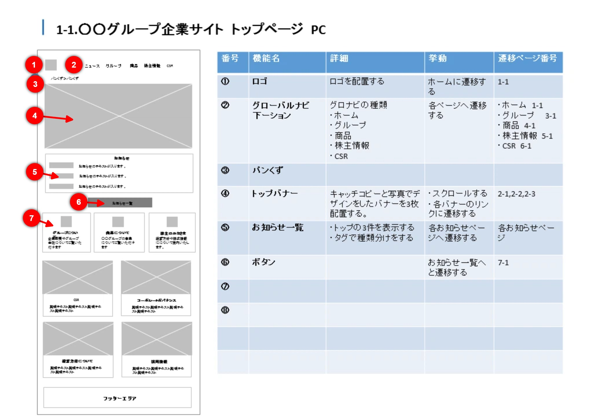

&fontSize=28&fontColor=ffffff)

### 🚀 実行URL: <a href="https://number-stamp.vercel.app/" target="_blank" rel="noopener noreferrer">https://number-stamp.vercel.app/</a>

###  ブログ: <a href="https://unitygamebox.com/" target="_blank" rel="noopener noreferrer">https://unitygamebox.com/</a>

## **概要**
<p style="font-size: 1.3em;">画像に連番スタンプ・矩形・テキスト・ペン・矢印等の注釈を配置し、作業手順書やバグ報告、レビュー画像などを素早く作成するためのWebアプリケーション</p>




<br>

---


ブラウザ上で画像を読み込み、直感的な操作で注釈を入れることができます。

### 1. 画像の読み込み
以下のいずれかの方法で背景画像をセットできます。
- **ドラッグ＆ドロップ**: ウィンドウ内に画像ファイルを直接ドロップします。
- **ファイル選択**: ツールバー右側の「画像アイコン」をクリックしてファイルを選択します。

### 2. ツールの種類と使い方
左側のツールバーでモードを切り替えて操作します。

| ツールバー | 機能 |
| :---: | :--- |
|  | **上から順に:**<br><br>👆 **選択 (Select)**<br>オブジェクトの選択・移動・編集<br><br>🔢 **スタンプ (Stamp)**<br>連番スタンプ配置<br><br>🔲 **矩形 (Rectangle)**<br>枠線・テキスト枠追加<br><br>🔤 **テキスト (Text)**<br>テキスト配置<br><br>✒️ **ペン (Pen)**<br>フリーハンド描画<br><br>📏 **直線・矢印 (Line)**<br>直線・矢印描画<br><br>↩️ **Undo / Redo**<br>元に戻す / やり直し<br><br>🖼️ **画像読込** / 📂 **プロジェクト読込**<br>ファイル読み込み関連<br><br>💾 **プロジェクト保存** / ⬇️ **画像保存**<br>保存・書き出し関連<br><br>❌ **全削除**<br>キャンバス初期化 |

---

### 👆 選択 (Select) モード
オブジェクトの選択・移動・編集を行います。

- **基本的な操作**: オブジェクトをクリックして選択します。選択状態のオブジェクトはドラッグして移動できます。
- **複数選択**: `Ctrl` (Macは `Cmd`) キーを押しながらクリック、または何もない場所からドラッグして範囲選択することで、複数のオブジェクトをまとめて移動・削除できます。
- **右クリック**: オブジェクトを右クリックすることでも選択状態にできます。

---

### 🔢 スタンプ (Stamp) モード
クリックした場所に連番スタンプを配置します。


- **自動連番**: スタンプを配置するたびに、設定された増分（Step）に従って番号が自動で進みます（例: 1 → 2 → 3）。
- **形状と色**: 設定パネルで「円」や「角丸四角」への切り替え、色やサイズの変更が可能です。
- **連続配置**: モードを切り替えるまで、連続してスタンプを押すことができます。

<br>

**🔗 スタンプ間の矢印 (Connect)**<br>
スタンプ等のオブジェクト間を矢印で結び、順序や関係性を示します。

1. **選択**: 「選択モード」で、矢印の始点となるスタンプをクリックして選択します。
2. **ハンドル操作**: スタンプの周囲（通常は右側）に表示される**水色（シアン色）の丸いハンドル**を探します。
3. **ドラッグ**: そのハンドルをドラッグして、矢印の先端を目的の場所（別のスタンプや任意の位置）まで引っ張ります。
4. **調整**: 矢印の色や太さは、始点となっているスタンプの設定に依存するか、個別に調整可能です（現状はスタンプに紐づく）。

---

### 🔲 矩形 (Rectangle) モード
ドラッグして矩形（四角い枠）を描画し、注目させたい箇所を強調します。

- **描画方法**: キャンバス上でドラッグすると、その範囲に矩形が作成されます。
- **テキスト入力**: 作成した矩形を選択し、右側の設定パネルでテキストを入力すると、枠内に文字を表示できます。
- **スタイル設定**: 枠線の色、太さ、塗りつぶしの有無、破線スタイルなどを自由に調整できます。

---

### 🔤 テキスト (Text) モード
画像上の任意の位置にテキストコメントを追加します。

- **配置**: クリックした位置にデフォルトまたは設定済みのテキストを配置します。
- **編集**: 配置後、設定パネルからテキストの内容、フォントサイズ、色、フォントファミリーを変更できます。
- **活用**: スタンプの説明や、画像全体への補足事項を記述するのに最適です。

---

### ✒️ ペン (Pen) モード
フリーハンドで線を描画します。

- **描画**: ドラッグして自由に線を描けます。注釈や強調に利用できます。
- **設定**: 色、太さ、不透明度を変更可能です。

---

### 📏 直線・矢印 (Line/Arrow) モード
任意の直線や矢印を描画するツールです。

- **描画**: ドラッグして直線を描画します。
- **編集**: 選択中に表示される始点・終点のハンドルを操作して、位置や角度を調整できます。
- **設定**: 線の色、太さ、始点・終点の矢印形状（なし/矢印）を変更可能です。

---


### 3. 詳細設定（右サイドバー）
オブジェクトを選択している時、またはツールを選択中に、右側のパネルで詳細な設定が可能です。


- **プロジェクト設定**:
  - **プロジェクト名**: 保存時のファイル名として使用されます。
  
- **オブジェクト設定** (選択中のツール/アイテムにより変化):
  - **スタンプ**: 番号、増分、形状サイズ、文字サイズ、形状 (Circle/Square)、形状色、文字色。
  - **矩形**: 枠線の太さ、色、塗りつぶし色、破線スタイル、内部テキスト設定 (配置・折り返し)。
  - **テキスト**: 内容、フォントサイズ、色。
  
- **共通設定**:
  - **色 (Color)**: プリセットカラーまたはカラーピッカーから選択。透明度 (Alpha) も指定可能。
  - **ズーム (Zoom)**: キャンバス表示の拡大・縮小。

<br clear="all">

### 4. 保存と書き出し
- **画像を保存 (Export)**: ツールバーの「ダウンロードアイコン」から PNG または JPG 形式で画像を保存します。高解像度で書き出されます。
- **プロジェクト保存 (Save)**: 作業状態（レイヤー情報、編集履歴など）を JSON ファイルとして保存できます。後で再編集可能です。
- **全削除 (Clear All)**: ツールバー一番下のゴミ箱アイコンで、キャンバスを初期状態にリセットします。

### 5. ショートカットキー
- **Undo (元に戻す)**: `Ctrl + Z` (Mac: `Cmd + Z`)
- **Redo (やり直し)**: `Ctrl + Y` (Mac: `Cmd + Shift + Z`)
- **Copy (コピー)**: `Ctrl + C` (Mac: `Cmd + C`)
- **Paste (貼り付け)**: `Ctrl + V` (Mac: `Cmd + V`)
- **Delete (削除)**: `Delete` / `Backspace`

<br>

---


React + Konva で構築されたSPA（Single Page Application）です。

### 動作環境
- Node.js (v18以上推奨)

### インストールと起動

```bash
# 依存パッケージのインストール
npm install

# スクリーンショット生成 (ドキュメント用)
npm run capture

# 開発サーバーの起動
npm run dev
```

ブラウザで `http://localhost:5173` にアクセスして動作を確認してください。

### ビルドとデプロイ

```bash
# プロダクションビルド
npm run build
```


ビルド成果物は `dist` ディレクトリに出力されます。

<br>

### 🛠️ 開発者モード (Developer Mode)

アプリケーションには隠し機能として「開発者モード」が実装されています。

- **有効化**: 右サイドバー下部のバージョン番号（例: `v1.5.0`）を **5回連続クリック** します。
- **機能**: 
    - 画面左上にデバッグ情報オーバーレイを表示（コンポーネント数、マウス座標、ズーム率など）。
    - 開発時のパフォーマンス確認や状態デバッグに使用します。


<br>

---
## 更新履歴

<details>

- **v1.5.0 (2026-02-19)**:
    - 🔢 スタンプ(Stamp)ツールの設定を強化
    - 形状サイズと文字サイズを個別に調整可能に
    - 形状色と文字色を個別に設定可能に
    - 🛠️ 開発者モード（デバッグ機能）を実装
- **v1.4.3 (2026-02-19)**:
    - 🎨 README.mdの見出しを全幅の帯デザインに変更・文字サイズ拡大
- **v1.4.2 (2026-02-19)**:
    - 🎨 README.mdのデザイン改善（バッジ風の見出し画像を採用）
- **v1.4.1 (2026-02-19)**:
    - 📄 README.mdのレイアウト調整（各大カテゴリの区切りを改善）
- **v1.4.0 (2026-02-19)**:
    - ✒️ ペンツール(Pen)機能を追加
    - 📏 直線・矢印ツール(Line/Arrow)機能を追加
    - 📄 ドキュメント更新
- **v1.3.0 (2026-02-18)**:
    - 📋 コピー＆ペースト機能を追加 (`Ctrl+C`, `Ctrl+V`)
    - スタンプ、矩形、テキストなどのオブジェクトを複製可能に
- **v1.2.1 (2026-02-18)**:
    - 💾 ファイル保存方式を改善（ブラウザのダウンロード履歴に残るように変更）
- **v1.2.0 (2026-02-18)**:
    - 🆕 矩形(Rectangle)ツールにテキスト入力機能を追加
    - 📚 ドキュメント更新（全モードの解説とスクリーンショット追加）
- **v1.1.0 (2026-02-17)**:
    - 🆕 テキスト入力ツールの追加
    - 🎨 色選択で透明度(Alpha)が扱えるように改善
    - 🖼️ 画像保存時にフォーマット(PNG/JPG)を選択可能に
- **v1.0.0**: 初版リリース。スタンプ、矩形、矢印、画像保存機能を実装。

</details>
