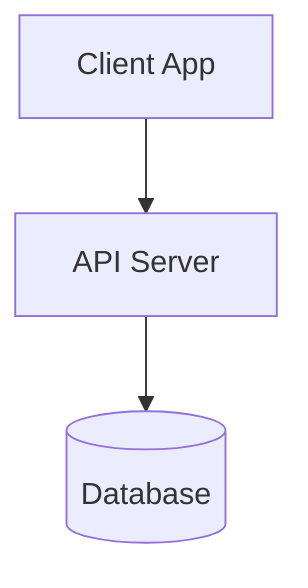
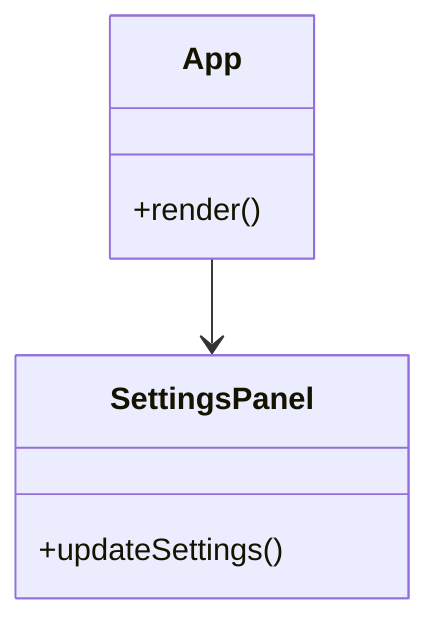
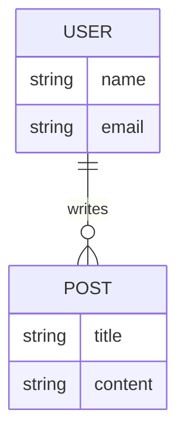
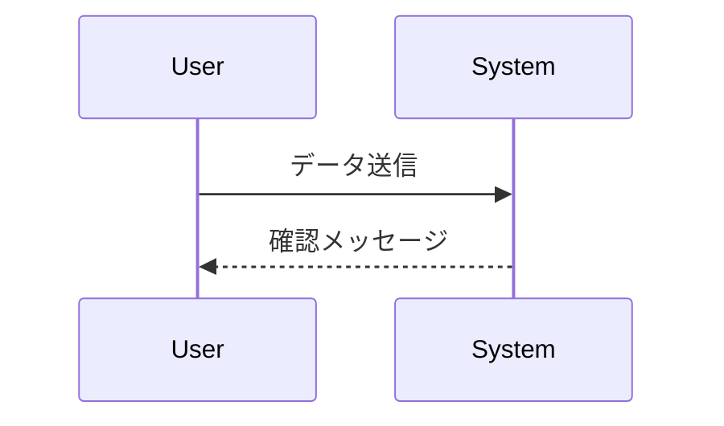

# [プロジェクト名] 設計書

## 1. アーキテクチャ概要
システムの全体像や技術選定理由を記述します。

### システム構成図

## 2. コンポーネント設計
主要なコンポーネントとその責務を定義します。

### コンポーネント図

## 3. データ設計
データモデルやER図を記述します。

### ER図

## 4. シーケンス図 (処理フロー)
重要な処理の流れを可視化します。

---

## 更新履歴
| 日付       | 版数 | 更新者 | 内容 |
| :---: | :---: | :---: | :--- |
| 2024/01/01 | 1.0  | 氏名   | 初版作成 |
