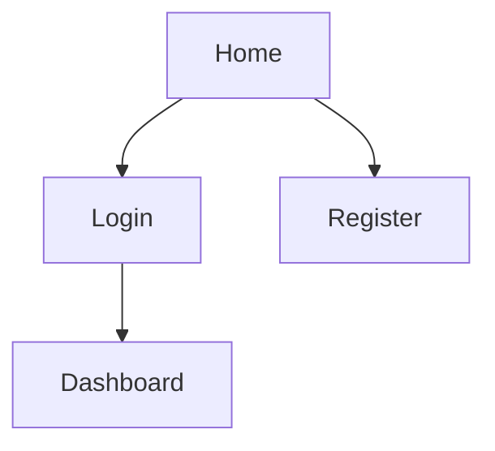

# [プロジェクト名] 要件定義書

## 1. 概要
本プロジェクトの目的と解決する課題について記述します。

## 2. ターゲットユーザー
誰のための機能・サービスなのかを定義します。

## 3. 機能要件 (Functional Requirements)
システムが提供すべき機能について詳細に記述します。

### 3.1 [機能名]
- **概要**:
- **入力**:
- **処理**:
- **出力**:

## 4. 非機能要件 (Non-Functional Requirements)
性能、セキュリティ、可用性などについて記述します。
- **パフォーマンス**:
- **セキュリティ**:
- **対応ブラウザ/OS**:

## 5. UI/UX
画面イメージや遷移図（Mermaid推奨）を記述します。

---

## 更新履歴
| 日付       | 版数 | 更新者 | 内容 |
| :---: | :---: | :---: | :--- |
| 2024/01/01 | 1.0  | 氏名   | 初版作成 |
